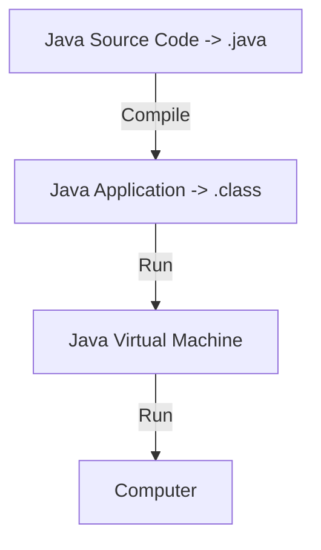

## [01] Java program

### 프로그램이란 무엇인가?

프로그램은 컴퓨터를 위한 작업 지시서로서 구체적으로 컴퓨터가 특정한 작업을 하기 위한 명령어들의 집합이다.

**명령어(instruction)**  CPU가 수행하는 기초적인 연산들을 말한다. 예로 두 개의 정수를 더하는 연산, 메모리에서 CPU로 정수를 가져오는 연산 등이 명령어에 속한다. 

**CPU (Central Processing Unit)**  컴퓨터에서 구성 단위 중 기억, 해석, 연산, 제어라는 4대 기능을 종합하는 중앙 처리 장치로서 컴퓨터의 대뇌라고 할 정도로 매우 중요한 부분 중 하나다.  

### 프로그래밍 언어

컴퓨터가 이해하는 단 하나의 언어는 기계어이다. 기계어는 프로그램이 CPU에 내리는 명령들을 표현하며, 0과 1로만 이루어져 있다. 그러나 기계어는 인간들의 관점에서는 이해하기 어렵고 불편한 언어이기때문에 프로그래밍 작업에 용이한 언어들을 만들었고 그 중에 하나가 Java 이다. 

**소스 코드 (source code)**  프로그래밍 언어를 사용하여 원하는 작업을 텍스트로 기술한 것 

**소스 파일 (source file)**   소스코드가 파일에 저장된 것

**컴파일러 (compiler)**  java와 같이 프로그래밍 언어로 작성된 프로그램을 기계어로 변환해주는 것

**오브젝트 파일 (object file)**  컴파일러(compiler)가 소스파일을 기계어로 변환한 파일  

### Java 언어의 탄생

Java는 19991년 미국의 '썬 마이크로시스템즈' 라는 회사에서 제임스고슬링을 비롯한 Green 연구팀에서 1995년에 개발한 **객체지향 프로그래밍 언어**이다. 처음에 이들은 가정용 전자제품 내에 탑재하는 프로그램을 만들기 위해 어떤 특정한 CPU에 의존하지 않는 가상 기계의 virtual machine 개념을 가져오게 되었다. 그러던 중 1993년 그래픽 기반의 월드 와이드 웹(World Wide Web)이 발표되어 자바팀은 자바와 월드와이드웹과의 연동을 추진하였다. 현재는 웹 어플리케이션 개발에 가장 많이 사용하는 언어가 되었다. 2010년에 '오라클(Oracle)'이 '썬마이크로시스템즈'를 인수하면서 Java의 저작권을 소유하게 되었다.  

### Java의 특징

**간단하다 (Simple)**

자바는 C++에 가깝지만 훨씬 간단하다. 자바는 고급 언어들에 들어있는 여러가지 요소들 중에서 반드시 필요하지 않다고 생각된 부분들은 모두 제거했다.

**객체 지향적이다 (Object‐oriented)** 

자바는 숫자(int, float, long 등)나 논리값(true, false)을 제외한 거의 모든 것이 객체로 구성되어 있다.

**인터프리터 언어이다 (Interpreted)**

자바는 정확하게 말하면 컴파일 언어인 동시에 인터프리터 언어이다. 자바는 먼저 텍스트 소스를 컴파일 하여 2진파일(클래스파일)로 만든다음 자바 런타임이 클래스파일을 인터프리트하면서 실행한다. 먼저 시스템에 무관한 2진파일을 만듬으로서 자바는컴파일언어에 가까운속도와 시스템 독립성을 동시에 얻을수있었다.

**강력하다 (robust)**

자바는 포인터 연산을 지원하지 않는다. 이는 잘못된 주소를 가르킬 가능성을 사전에 없앤 것이다. 자바는 모든 메모리 접근을 자바 시스템이 관리하고 제한하며 또한 예외 핸들링을 하여 시스템 붕괴의 우려가 없다.

**안전하다 (Secured)**

자바는 프로그램 작성 시 자료형 타입에 굉장히 민감하다. 이것은 마치 코딩할 때 잔소리꾼이 끊임없이 따라다니며 잘못된 코드를 작성하지 않게끔 도와주는 역할을 한다. 그래서 자바는 일단 컴파일만 되면 실행 시오류가 발생하는 경우가 다른 언어에 비해 현저히 낮다.

**독립적이다 (Platform independent)** 

자바의 실행 파일은 이진 코드 (클래스) 파일이다. 따라서 자바 런타임이 설치된 시스템에서는 어디서나 자바 프로그램을 실행할 수 있다.

**멀티 쓰레딩을 지원한다 (Multithreaded)** 

멀티 쓰레드를 지원할 경우 하나의 프로그램 단위가 동일한 쓰레드를 동시에 수행할 수 있다. 특히 자바는 멀티 프로세서 하드웨어를 지원하도록 설계되었으므로 멀티 CPU 시스템에서 높은 효율을 낼 수 있다.

**동적이다 (Dynamic)** 

자바 인터페이스를 이용하면 하나의 모듈을 갱신할 때 다른 모듈을 모두 갱신할 필요가 없다. 이것은 인터페이스가 모든 인스턴스 변수와 도구의 실행문을 배제한 채 객체 간의 상호 작용을 정의하기 때문이다.  

### Java의 동작원리

### Java 프로그래밍 환경설정

자바 개발을 위해서는 JDK(Java Development Kit : 자바 개발 키트)가 필요하다. 이 JDK는 오라클에서 배포하고 있다. JDK 설치가 완료되었다면 자바 프로그램 작성을 도와주는 도구가 필요하다. 이러한 문서 작성을 도와주는 도구로 워드나 HWP가 있는 것처럼 프로그램 작성을 도와주는 툴을 IDE(Intergrated Development Environment : 통합 개발 환경)이라고 부른다. 자바 프로그래밍을 도와주는 IDE로 많이 추천되는 툴은 ECLIPSE 또는 IntelliJ 이다.