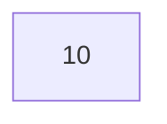

## [02] Variable


다음과 같은 a, b를 변수(Variable)라고 한다.

```java
int a;
String b;
```

💡 **변수란?**

1. 프로그램 작업을 처리하기 위해 하나의 값을 저장할 수 있는 메모리 공간을 말한다.
2. 임의의 메모리 공간에 이름을 붙여 관리하는 것이다.
3. 자바에서는 다양한 타입을 저장할 수 없고, 한가지 타입만 값으로 저장할 수 있다.
4. 식별자(identifier)라고도 부른다: 자바 코드에서 변수로 입력시킨 이름의 의미한다.


### 기본자료형

| 자료형 | 키워드  | 메모리 크기 | 표현범위                                               |
| ------ | ------- | ----------- | ------------------------------------------------------ |
| 정수형 | byte    | 1 byte      | -128 ~ 127                                             |
|        | short   | 2 byte      | -32,768 ~ 32,767                                       |
|        | int     | 4 byte      | -2,147,483,648 ~ 2,147,483,647                         |
|        | long    | 8 byte      | -9,223,372,036,854,775,808 ~ 9,223,372,036,854,775,807 |
| 실수형 | float   | 4 byte      | -3.4E38 ~ +3.4E38                                      |
|        | double  | 8 byte      | 1.7E308 ~ + 1.7E308                                    |
| 문자형 | char    | 1 byte      | 0~65,535                                               |
| 논리형 | boolean | 2 byte      | true, false                                            |


### 변수의 선언

```java
// 1. 자료형  변수명
// 변수의 선언과 값의 대입을 분리하는 방법
int num1;
num1 = 10;		
		
// 2. 자료형 변수명 = 값
// 변수의 선언과 동시에 값을 대입하는 방법
int num2 = 20;
		
// 3. 자료형  변수명1, 변수명2
// 동일한 자료형 타입의 변수를 다수 선언하는 방법
int num3, num4;
		
// 4. 자료형 변수명1 = 값1, 변수명2 = 값2;
// 동일한 자료형 타입의 변수를 다수 선언하면서 값을 대입하는 방법
int num5 = 50, num6 = 60;
int num7, num8 = 80, num9;
```


### 기초 데이터 타입과 참조 데이터 타입

자바에는 기초형(primitive type)과 참조형(reference type) 크게 두 가지 타입의 변수로 나눌 수 있다. 기초형 변수는 변수의 값이 저장되어 있으나, 참조형 변수에서는 객체의 위치(참조 또는 주소)가 들어가 있다. Scanner 와 같이 대문자로 시작하는 것들은 참조형, int 와 같이 소문자로 시작하는 것들을 기초형이라고 우선 구분할 수 있다.


1. **기초 데이터 타입(primitive 기본 자료형)**

   메모리에 있는 실제 값 = 변수 데이터 값

```java
int i = 10;
```



2. **참조 데이터 타입(Object, 객체 자료형)**

   메모리에 있는 실제 값(static 영역) = 변수가 저장된 주소(실제 변수 데이터는 heap영역)

   여러가지 데이터들이 모여있는 복잡한 데이터로 기본 자료형에 비해 크기가 크다.

```java
String str = "Hello, java"
```


### 데이터 타입의 형변환

1. **묵시적 형변환**

   자동 형 변환 또는 promotion이라고 하며 기본 데이터 형 및 참조 데이터 형 모두 가능하다. 별도의 설정없이도 변경이 가능하지만, 데이터 타입의 메모리크기가 큰것이 작은 것으로 변환되진 않는다.


2. **명시적 형변환**

   큰 주머니의 데이터를 작은 주머니로 옮기는 것. 데이터의 손실이 있을 수 있으며 코드에 명시해 주어야 한다.

```java
double d = 10.15;
int i = (int)d; // 10
```

