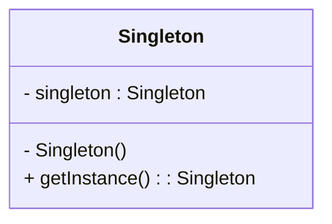
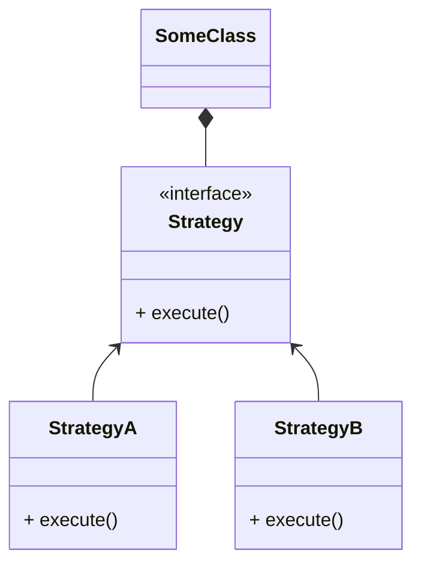

## [13] Pattern 패턴

### Design Pattern

객체지향 언어의 상속, 인터페이스, 추상화 등의 기능을 이용하여 효율을 극대화하고, 유지 보수 측면에서도 효율적으로 개발을 할 수 있도록 객체지향 언어들의 장점들을 모아 만들어 놓은 프레임.

### SingleTon Pattern

싱글톤 패턴(Singleton pattern)이란 클래스의 객체는 오직 하나인 유일한 객체를 만들어 여러가지 상황에서 동일한 객체에 접근하기 위해 만들어진 패턴이다. 싱글톤 패턴을 따르는 클래스는 생성자가 여러차례 호출되어도 실제로 생성되는 객체는 하나이고 이 객체에 접근할 수 있는 전역적인 접촉점을 제공한다.

💡**singleTon 객체의 이점**

- 프로그램 전역에서 활용할 재료로 사용되는 공유 기능을 하나만 생성하여 여러 곳에서 재사용함으로서 메모리를 효율적으로 사용할 수 있다.
- 단 한번만 객체를 생성하면 다시 객체를 생성할 필요가 없기 때문에, 해당 기능을 사용할 때마다 객체를 일일이 생성해야하는 번거로움을 피할 수 있다.

### Strategy Pattern

기능(알고리즘)을 클래스로 캡슐화하여 동적으로 행위를 자유롭게 바꿀 수 있는 패턴으로, 기능을 사용하는 클라이언트와는 상관없이 독립적으로 기능을 변경할 수 있다. 즉, 여러 옵션들마다의 행동을 모듈화하여 독립적이고 기능을 쉽게 바꿀 수 있도록 만드는 디자인 패턴이다.

