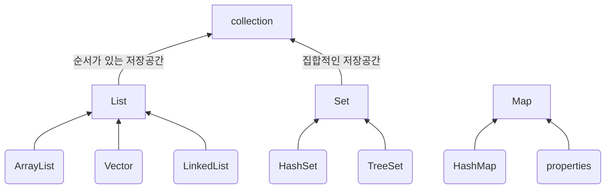

## [16] Java Collection

💡**컬렉션이란?** 

쉽게 말해서 자료구조이다. 쉽게말해 다수의 데이터를 담은 데이터 그룹의 의미한다. 데이터 성질에 따라 데이터를 관리하는 방식이 다르기 때문에 Java에서는 다양한 자료구조형을 제공하고 있다. 자료구조형 안에서는 객체의 레퍼먼스만을 관리한다.

### 컬렉션을 사용하는 이유

- **일관된 API**

  Collection의 일관된 API를 사용하여 Collection 밑에 있는 모든 클래스(ArrayList, Vector, LinkedList 등) Collection에서 상속받아 통일된 메서드를 사용하게 된다.

- **프로그래밍 노력 감소**

  객체 지향 프로그래밍의 추상화의 기본 개념이 성공적으로 구현되어 있다.

- **프로그램 속도 및 품질 향상**

  유용한 데이터 구조 및 알고리즘은 성능을 향상시킬 수 있다. Collection을 사용하여 최상의 구현을 생각할 필요없이 간단하게 Collection API를 사용하여 구현을 하면 된다.

### **자바에서 제공되는 Collection 자료 구조**

### List Interface

순서가 있는 데이터의 집합으로 데이터의 중복을 허용한다. List는 처음 만들 때 크기를 고정하지 않아도 되고 그 크기는 유동적이다.

- **ArrayList**

  단방향 포인터 구조로 각 데이터에 대한 인덱스를 가지고 있어 조회 기능에 성능이 뛰어나다. 표준 배열보다 느릴 수 있지만 배열에서 많은 움직임이 필요한 프로그램에서 유용하다.

- **Vector**

  과거에 대용량 처리를 위해 사용했으며, 내부에서 자동으로 동기화처리가 일어나 비교적 성능이 좋지 않고 무겁다.

- **LinkedList**

  양방향 포인터 구조로 데이터의 삽입, 삭제가 빈번할 경우 데이터의 위치정보만 수정하면 되기에 유용하며, 각 요소를 가리키는 참조만 변경하면 되므로 아주 빠르게 저장과 삭제가 가능하다.

### Set Interface

순서를 유지하지 않는 데이터의 집합으로 데이터의 중복을 허용하지 않는다. 중복을 방지하고 고유한 데이터만 저장해야하는 경우 사용된다. 

- **HashSet**

  순서를 예측할 수 없으며 해시 알고리즘(hash algorithm)을 사용하여 검색 속도가 매우 빠르다.

- **TreeSet**

  데이터가 정렬된 상태로 저장되는 이진 검색 트리(binary search tree)의 형태로 요소를 저장한다. 이진 검색 트리는 데이터를 추가하거나 제거하는 등의 기본 동작 시간이 매우 빠르다.

### Map Interface

키(Key), 값(Value)의 쌍으로 이루어진 데이터으 집합으로, 순서는 유지되지 않으며 키(Key)의 중복을 허용하지 않으나 값(Value)의 중복은 허용한다.

- **HashMap**

  중복과 순서가 허용되지 않으며 NULL 값이 올 수 있다.

- **Properties**
