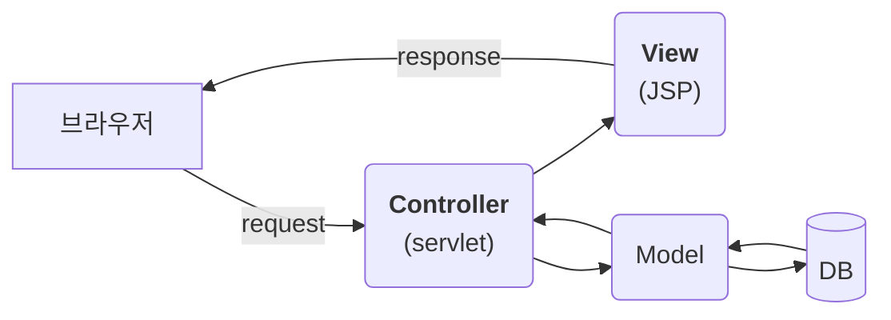
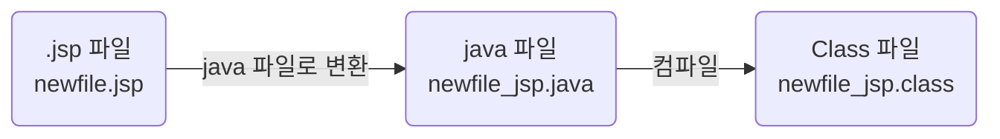

## [02] JSP 맛보기

### **JSP 특징**

- 동적 웹어플리케이션 컴포넌트(컴포넌트는 JSP, HTML 등 웹 어플리케이션을 이루는 요소를 컴포넌트라고 하고 그 컴포넌트를 담고 있는 것을 컨테이너라고 한다)
- `.jsp` 확장자
- 클라이언트의 요청에 동적으로 작동하고 응답은 html을 이용한다.
- jsp는 서블릿으로 변환되어 실행된다. (컴파일되면 톰캣서버가 변환한다.)

- MVC패턴(각자의 역할을 분담)에서 View로 이용된다.

  Request – Controller-Model(DB연동 포함) –View-response

### JSP 아키텍처

1. **아키텍처**

2. **생성파일 위치**

   D:\bigdata\IDE\apache-tomcat-10.0.12\work\Catalina\localhost\ch02_semiJSP\org\apache\jsp