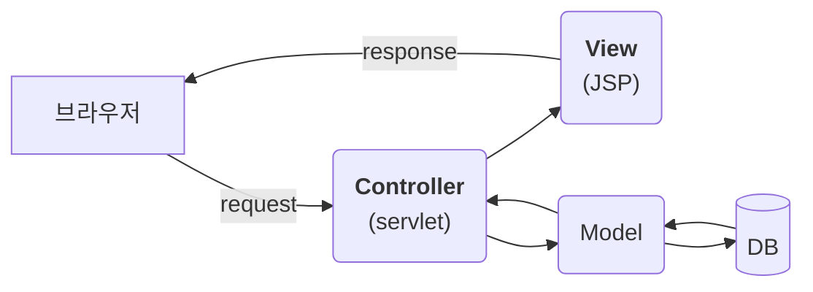
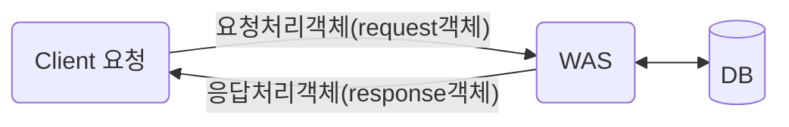

## [03] Servlet 맛보기

### **Servlet의 특징**

- 동적 웹 어플리케이션 컴포넌트: JSP와 같다

- `.java` 확장자

  JAVA 언어를 사용하여 웹 프로그램을 제작

- 클라이언트의 요청에 동적으로 작동하고 응답은 html을 이용한다.

- java thread를 이용하여 동작

  서블릿을 이용하는 가장 큰 장점으로 웹컴포넌트를 구성하는 다른 언어에 비해 요청이 많이 들어와도 서버의 부하가 많이 걸리지 않는 장점이 있다.

- MVC패턴에서 Controller 부분에 이용



### Servlet 파일 생성

1. Java package : com.lec.ex / Class Name : HelloWorld

2. SupperClass : javax.servlet.http.HttpServlet 

   서블릿은 일반 클래스와 다르게 상속받아야 하는 클래스가 있다. HttpServlet 클래스를 상속 받아야 서블릿 클래스가 된다.

3. 매핑 단계 : 웹상에서 접근해야 하는 주소 (어노테이션 혹은 xml을 이용한다.)


**어노테이션을 이용한 서블릿 맵핑**

```java
@WebServlet(name = "HelloWorld", description = "Ex1", urlPatterns = { "/HelloWorld" })
@WebServlet("/HelloWorld")
```


**Web.xml을 이용한 서블릿 맵핑**

```java
<servlet>
	<servlet-name>helloworld</servlet-name>  
	<servlet-class>com.lec.ex.HelloWorld</servlet-class>
</servlet>
<servlet-mapping>
  	<servlet-name>helloworld</servlet-name>
  	<url-pattern>/hw</url-pattern>
</servlet-mapping>
```

- **servlet-class** : 매핑할 클래스 파일명을 패키지명을 포함하여 입력
- **url-pattern** : 해당 프로젝트의 context path 후의 경로를 지정하는 부분으로, `/` 으로 시작해야 한다.


### 요청처리객체 및 응답처리객체



- 클라이언트 측 ➡️ WAS: 톰캣에서 request 객체 생성. 요청을 하는 객체
- 클라이언트 측 ⬅️ WAS: 톰캣에서 response 객체 생성. 응답을 하는 객체

요청을 하는 객체는 클라이언트로부터 오는 정보를 갖고 올 수 있다. 

예를 들어 로그인 페이지에 들어가서 아이디와 패스워드를 넣고 버튼을 누르면 회원이면 로그온이 되고 비회원이면 회원가입페이지나 거절페이지로 가도록 한다.

응답하는 객체에서는 회원이 맞는지 아닌지 결과값을 `response`객체에 실어 보낸다.