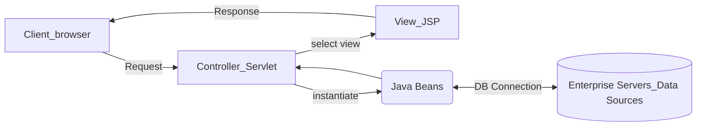

## [04] SERVLET

서블릿(servlet)은 JSP 표준이 나오기 전에 만들어진 표준으로 자바에서 웹 어플리케이션을 개발 할 수 있도록 하기 위해 만들어 졌으며 자바 클래스를 웹에서 실행할 수 있도록 작성된 웹 프로그램이다.

**작성과정**

- 서블릿 규칙에 따라 자바 코드 생성
- 경우에 따라 web.xml 파일에서 서블릿을 주소와 매핑
- 웹 컨테이너 재실행

**서블릿 요청 처리**

- 요청 방식에 따라 `doGet( )`이나 `doPost( )` 메소드를 재정의해서 처리
- service 메소드를 재정의해서 사용할 수 있는데 이 메소드는 get 방식이나 post 방식 상관 없이 호출되며 이 메소드가 호출되면 `doGet( )`이나 `doPost( )` 메소드는 호출되지 않는다.
- 서블릿에서 요청을 처리하기 위해 오버라이딩 한 메서드는 `request` 객체를 이용해서 웹 브라우저의 요청 정보를 읽어 오던가 아니면 `response`를 이용해서 응답을 전송할 수 있다.
- 응답을 전송하고자 하는 경우는 `response` 객체의 `setContentType()` 메서드를 이용해서 타입과 인코딩 방식을 지정해 주어야 한글이 깨지지 않는다.
- 웹 브라우저에 데이터를 전송하려면 `getWriter( )`를 호출해서 문자열 데이터를 출력할 수 있는 `PrintWriter`를 가져오고 `print( )`나 `println( )`을 이용해서 전송한다.

**Get : URL 값으로 정보가 전송되어 보안에 취약**

- 주소와 매개변수를 붙여서 주소 표시줄에 입력하는 방법(?로 구분)
- a 태그를 이용해서 페이지를 요청하는 경우
- form태그에서 명시적으로 GET방식으로 요청하는 경우 (method=”get”)
- 매개변수의 데이터는 255자 이내이며 보안성이 없음

**Post : header를 이용해 정보가 전송되어 보안에 강함**

- form태그에서 명시적으로 POST 방식으로 요청 (method=”post”)
- 데이터의 크기에 제한이 없으며 URL에 표시되지 않으므로 보안성이 우수
- 한글 파라미터 전달시 request.setCharacterEncoding(“utf-8”)추가

### Context Path 컨텍스트 패스

WAS(Web Application Server)에서 웹어플리케이션을 구분하기 위한 path. 해당 웹 어플리케이션이 이름. 이클립스에서 프로젝트를 생성하면, 자동으로 server.xml에 추가된다. 

그러므로, 프로젝트를 삭제하고 다시 같은 이름의 프로젝트를 생성할 수 없다.

**Servlet 작동순서**

클라이언트에서 servlet요청이 들어 오면 서버에서는 servlet컨테이너를 만들고, 요청이 있을 때마다 스레드가 생성된다.