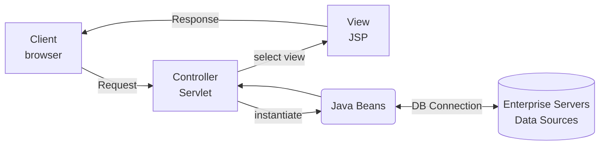

## [04] Servlet 웹 프로그래밍

서블릿은 JSP 표준이 나오기 전에 만들어진 표준으로 자바에서 웹 어플리케이션을 개발할 수 있도록 하기 위해 만들어 졌으며, 자바 클래스를 웹에서 실행할 수 있도록 한 웹프로그램이다.

일반 클래스인 자바 파일을 서블릿으로서 구현하려면 `javax.servlet.http.HttpServlet` 클래스로부터 상속받아서 작성해야 한다. 위의 클래스는 톰캣의 servlet-api.jar 에 포함되어 있다.

**작성과정**

- 서블릿 규칙에 따라 자바 코드 생성
- 경우에 따라 `Web.xml` 파일에서 서블릿을 주소와 매핑
- 웹 컨테이너 재실행

**서블릿 요청 처리**

- 요청 방식에 따라 `doGet`이나 `doPost` 메서드를 재정의해서 처리
- `service` 메서드를 재정의해서 사용할 수 있는데 이 메서드는 get 방식이나 post 방식 상관없이 호출되며 이 메서드가 호출되면 `doGet`이나 `doPost` 메서드는 호출되지 않는다.

- 서블릿에서 요청을 처리하기 위해 오버라이딩 한 메서드는 `request` 객체를 이용해서 웹 브라우저의 요청 정보를 읽어오기 또는 `response`를 이용해서 응답을 전송할 수 있다.
- 응답을 전송하고자 하는 경우는 `response` 객체의 `setContentType() ` 메서드를 이용해서 타입과 인코딩 방식을 지정해 주어야 한글이 깨지지 않는다.

- 웹 브라우저에 데이터를 전송하려면 `getWriter()`를 호출해서 문자열 데이터를 출력할 수 있는 `PrintWriter`를 가져오고 `print()`나 `println()`을 이용해서 전송한다.

### Get방식과 Post방식

클라이언트측에서 WAS로 요청하는 방식은 Get방식과 Post방식 두가지가 있으며 HTML 코드 안의 `method=" "`태그에 작성에 따라 정해진다.

**Get** : URL값으로 정보가 전송되어 보안에 취약

- 주소와 매개변수를 붙여서 주소 표시줄에 입력하는 방법 (?로 구분)
- a 태그를 이용하여 페이지를 요청하는 경우
- form 태그에서 명시적으로 Get 방식으로 요청`method="get"`
- 매개변수의 데이터는 255자 이내

**Post** : header를 이용해 정보가 전송되어 보안에 강함

-  form 태그에서 명시적으로 Post방식으로 요청 `method="post"`
- 데이터의 크기에 제한이 없으며 URL에 표시되지 않으므로 보안성이 우수
- 한글 파라미터 전달 시 `request.setCharacterEncoding(“utf-8”)`추가

-----

💡 **한글처리**

Tomcat 서버의 기본 문자 처리 방식은 IOS-8859-1 방식 이다. 따라서 개발자가 별도의 한글 인코딩을 하지 않으면 한글이 깨져 보이는 현상이 있다.

- response객체 : `response.setContentType("text/html;charset=utf-8");`
- request객체(POST방식) : `request.setCharacterEncoding("utf-8");`

### Servlet Parameter

`Form`태그의 `submit` 버튼을 클릭하여 데이터를 서버로 전송하면 해당파일(Servlet)에서는 `HttpServletRequest`객체를 이용하여 `Parameter`값을 얻을 수 있다.

- `request.getParameter("파라미터이름");`
- `request.getParameterValues("파라미터배열이름");`
- `request.getParameterNames( );` 파라미터 이름들이 배열로